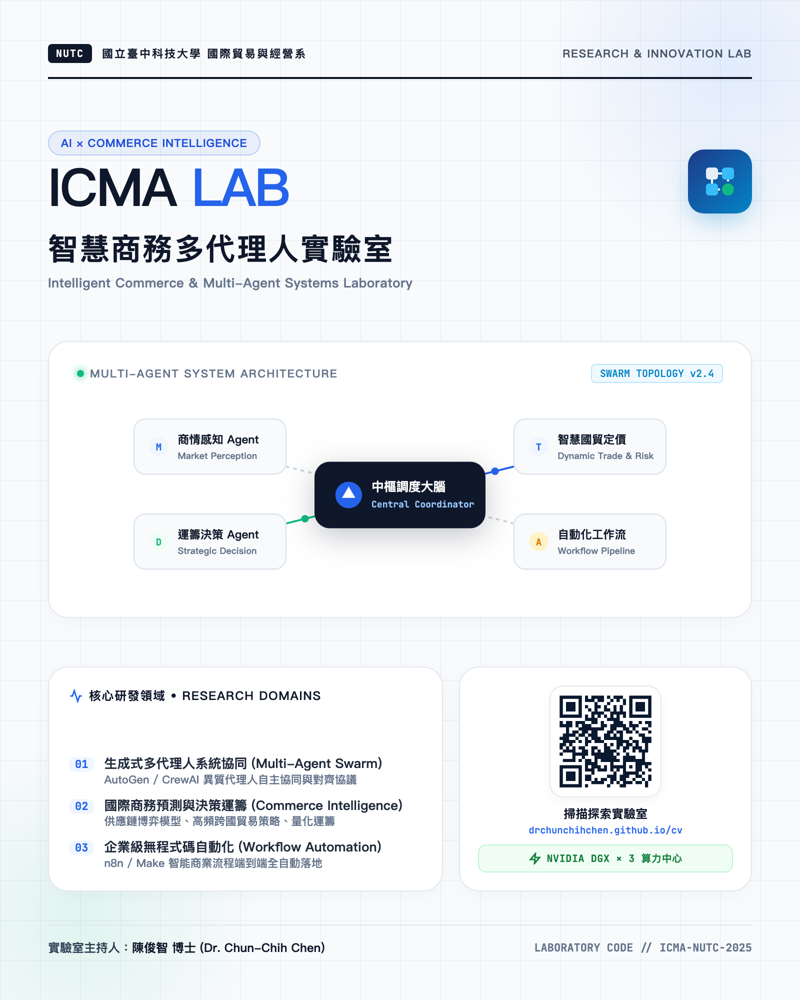

# Dr. Elvis Chen (陳俊智 博士) - Academic Portfolio & Curriculum Vitae

[](https://drchunchihchen.github.io/cv/)
[](https://orcid.org/0000-0001-6556-2221)
[](https://www.youtube.com/@ElvisChen-p7z2r/playlists)
[](https://drchunchihchen.github.io/xiaobantian-carbon-tourism/#videos)
[](https://it.nutc.edu.tw/%E5%B0%88%E4%BB%BB%E6%95%99%E5%B8%AB/)

> **Quantitative Decision Modeling for Environmental & Resource Economics via Intelligent Technologies**  
> 利用智慧技術的分析能力，為環境資源經濟的重大議題，建立量化的決策模型。

---

## 📌 Professional Affiliations & Roles (現職與經歷)

* **專任副教授 (Associate Professor)**  
  國立臺中科技大學 國際貿易與經營系 (National Taichung University of Science and Technology, Dept. of International Business) | *2025.08 – 迄今*
* **中心主任 (Director)**  
  國立臺中科技大學 商業智慧應用與研究中心 (Center for Business Intelligence Applications and Research, NUTC) | *2024.08 – 迄今*
* **實驗室主持人 (Lab Director)**  
  國立臺中科技大學 智慧商務多代理人實驗室 (Intelligent Commerce & Multi-Agent Lab, ICMA Lab) | *2024.08 – 迄今*
* **淨零組組長 (Former Director, Net-Zero Division)**  
  國立臺中科技大學 永續創新與淨零推動中心 (Sustainability Center, NUTC) | *2024.08 – 2025.07*
* **供應鏈數位轉型顧問工程師 (SCM Digital Transformation Consultant)**  
  台灣康寧顯示玻璃 (Corning Display Technologies Taiwan) | *2022.12 – 迄今*
* **人工智慧顧問工程師 (AI Consultant Engineer)**  
  快思股份有限公司 (Crysalis AI) | *2020.08 – 迄今*
* **博士後研究員 & 助理研究員 (Postdoctoral Fellow)**  
  東海大學 校務研究中心 (Tunghai University, Institutional Research Center) | *2020.08 – 2022.07*
* **訪問學者 (Visiting Scholar)**  
  美國北卡羅來納州立大學 (North Carolina State University, NCSU)

---

## 🤖 Intelligent Commerce & Multi-Agent Systems Lab (智慧商務多代理人實驗室)

> **「國貿系最多 Token 的實驗室：你有點子，老師有 Token！」**  
> 主持人：陳俊智 副教授 (Dr. Chun-Chih Chen) | 國立臺中科技大學 國際貿易與經營系  
> *—— 國貿＋AI FDE（前進部署工程師）的實戰基地，3 台 NVIDIA DGX 算力全開，一起把點子燒成落地產品。*

<p align="center">
  <a href="https://drchunchihchen.github.io/cv/#laboratory">
    
  </a>
</p>

* **實驗室亮點**：🔥 **國貿系最多 Token 的實驗室**，別讓 API 餘額限制你的狂想！
* **核心技術**：AI 代理人團隊分工協同 (AutoGen / CrewAI)、智慧商務預測與數據決策、企業流程全自動化 (n8n / Make)。
* **運算資源**：配備 **NVIDIA DGX × 3** 旗艦算力中心（Token 吃到飽支援）。
* **招生與人才招募**：歡迎對 AI 代理人應用、商業自動化與創新創業有熱忱的同學加入！([申請加入](mailto:elvischen@nutc.edu.tw?subject=申請加入智慧商務多代理人實驗室))

---

## 🔬 Core Research Dual Tracks (整合性研究雙主軸)

```
                       ┌─────────────────────────────────────────────────────────┐
                       │     數據驅動的永續治理與智慧決策整合體系                  │
                       │ Data-Driven Sustainable Governance & Intelligent Dec.   │
                       └────────────────────────────┬────────────────────────────┘
                                                    │
                 ┌──────────────────────────────────┴──────────────────────────────────┐
                 ▼                                                                     ▼
   【主軸一：深化永續發展研究】                                           【主軸二：智慧轉型與前瞻技術】
   Sustainable Development & Economics                                 Intelligent Transformation & AI
   • 循環經濟與生態足跡拆解 (CE-EF Nexus)                                • 大語言模型 (LLM API & Multi-Agents)
   • 承載能力因子 (LCF) 與能源轉型                                       • 供應鏈物料需求規劃 (MRP 演算法)
   • 經濟成長與環境壓力脫鉤 (Decoupling)                                 • 端到端供應鏈可視化 (E2E Visibility)
   • 國家溫室氣體與碳盤查 (ISO 14064)                                    • AI 雙軌轉型與智慧製造數位師徒制
```

* **🌿 主軸一：永續淨零與企業碳盤查**  
  主持國科會專題（CE-EF 生態足跡模型與脫鉤戰略）；執行工研院與製造業（世聚、寶暉等）ISO 14064 企業碳盤查輔導專案；推動 USR「小半天低碳漫遊與碳盤查實務」；自主研發「你說的算」敏捷碳盤查/足跡系統。
* **⚡ 主軸二：智慧製造與 AI Agent 自動化**  
  專精生產排程優化、MRP 演算法與生成式 AI Agent 協同架構（n8n / LLM API 企業工作流自動化）；深耕台灣康寧產學、快思 (CRIS) 與工研院 AI 雙軌轉型計畫；自主研發「HelloIR」智慧決策平台。

---

## 🏆 Highlights & Key Metrics (重點成果與數據)

* **12+ 篇 SCI / SSCI 國際知名期刊論文**（多篇發表於 Q1/Q2 頂級期刊，包含 *Ecological Indicators*, *RCIM*, *Journal of Cleaner Production* 等）。
* **Top 1% ESI Highly Cited Paper**（工程領域前 1% 全球高被引論文）。
* **NT$ 7.0M+ 計畫總經費**：
  * 主持 **國科會專題研究計畫** 與 **國科會新進人員計畫**。
  * 主持 **台灣康寧 (Corning Taiwan)** 長期策略產學合作計畫（累積逾 208 萬元）。
  * 執行工研院、快思、日堡精密、海峰機械、哈伯精密等 2026 最新產學合作案。
  * 連續兩年主持勞動部就業學程（160 萬元）與教育部新南向實習計畫。
* **全國競賽指導冠軍**：
  * 2025 高科大全國電子設計創意競賽（大數據應用組）**全國冠軍**。
  * 2024-2025 第十屆阿里巴巴 B2B 全國大專院校跨境電商競賽 **全國第一名**。

---

## 💻 Software Systems & USR Projects (自研系統與社會責任計畫)

* **碳盤查 / 碳足跡軟體：「你說的算」**  
  敏捷型組織溫室氣體盤查與碳足跡計算工具，支援排放係數對應與減碳情境模擬。([觀看操作示範影片](https://www.youtube.com/watch?v=epZr5-JSLLM))
* **HelloIR 智慧校務分析與決策支援平台**  
  結合巨量數據探勘與機器學習演算法之決策支援平台，針對高等教育治理與修業風險進行即時分析。([觀看產品介紹影片](https://www.youtube.com/watch?v=bP8hiMcb81g))
* **國立臺中科技大學 USR 計畫 — 小半天永續低碳漫遊與遊程碳盤查實務手冊**  
  推動南投鹿谷在地綠色生態旅遊與碳排量化評估，建置多媒體影音互動手冊網站。([專屬成果網站](https://drchunchihchen.github.io/xiaobantian-carbon-tourism/#videos))
* **Elvis Chen 線上教學影音頻道**  
  收錄 Python 商務程式設計、智慧商務 (BI)、機器學習與 AI 提示工程等系統化播放清單。([前往 YouTube 頻道](https://www.youtube.com/@ElvisChen-p7z2r/playlists))

---

## 📂 Website Structure & Pages (網站頁面架構)

| Page | Description | Link |
| :--- | :--- | :--- |
| **Home (`index.html`)** | 個人簡介、研究雙主軸、核心專長、精選作品集導覽 | [線上瀏覽](https://drchunchihchen.github.io/cv/) |
| **Publications (`publications.html`)** | 完整期刊論文、代表作標註、研討會論文、國際期刊審查委員 | [查看著作](https://drchunchihchen.github.io/cv/publications.html) |
| **Projects (`projects.html`)** | 2021-2026 國科會專題、台灣康寧產學案、2026 最新企業委託研究 | [查看計畫](https://drchunchihchen.github.io/cv/projects.html) |
| **Awards (`awards.html`)** | 指導學生全國競賽獲獎紀錄、成果影片展示、個人學術榮譽 | [查看獲獎](https://drchunchihchen.github.io/cv/awards.html) |
| **Teaching (`teaching.html`)** | 智慧商務、Python 商務程式設計、提示工程、Colab 實作講義 | [教學資源](https://drchunchihchen.github.io/cv/teaching.html) |
| **Talks (`talks.html`)** | 國內外受邀學術專題演講與企業培訓工作坊 | [專題演講](https://drchunchihchen.github.io/cv/talks.html) |

---

## 📬 Contact (聯絡資訊)

* **Email**: [elvischen@nutc.edu.tw](mailto:elvischen@nutc.edu.tw)
* **Office**: 國立臺中科技大學 中正大樓 7 樓 3705 研究室
* **Phone**: +886-4-2219-6120
* **Address**: 404 台中市北區三民路三段 129 號

---

*Copyright &copy; 2026 Dr. Elvis Chen (陳俊智). All Rights Reserved.*
